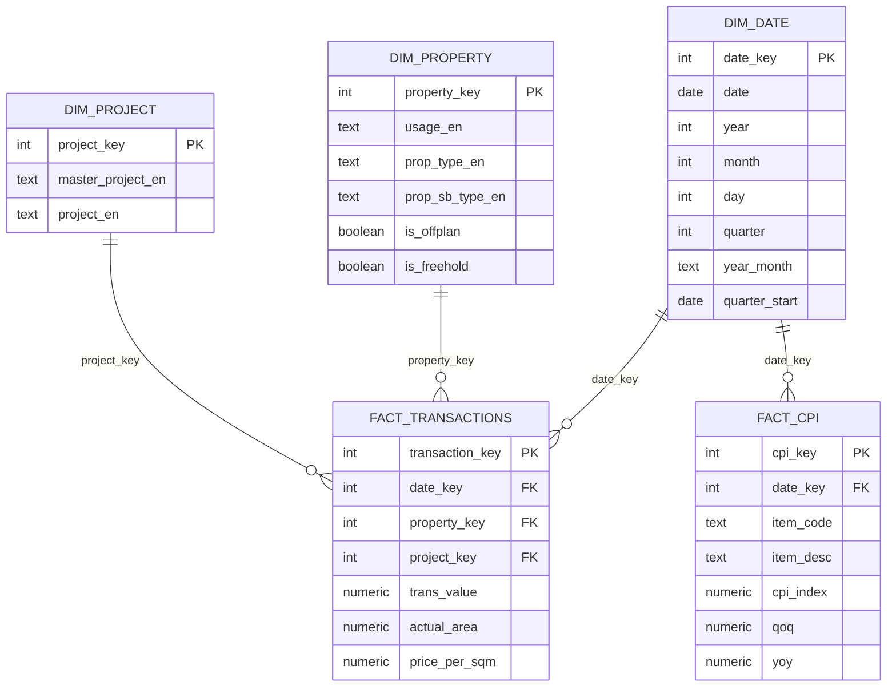

````markdown
# Entity–Relationship Diagram (ERD)

The data warehouse uses a **star schema** where transaction and CPI facts sit at the centre and are linked to several dimension tables.  This structure facilitates efficient analytical queries and straightforward integration with Power BI.

## Visual Diagram



## Text-Based Diagram (Legacy)

```
             +-----------------+             +-------------------+
             |  dw.dim_date    |             |  dw.dim_property  |
             +-----------------+             +-------------------+
              \               /             /                 \
               \             /             /                   \
                \           /             /                     \
                 v         v             v                       v
            +-------------------------------------------------------------+
            |                    dw.fact_transactions                    |
            +-------------------------------------------------------------+
            | transaction_key (PK)                                        |
            | date_key (FK → dim_date.date_key)                          |
            | property_key (FK → dim_property.property_key)              |
            | project_key (FK → dim_project.project_key)                 |
            | trans_value                                                 |
            | actual_area                                                |
            | price_per_sqm                                              |
            +-------------------------------------------------------------+
                ^         ^             ^                       ^
                |         |             |                       |
                |         |             |                       |
   +-----------------+ +-------------------+             +-------------------+
   | dw.dim_project  | |   dw.fact_cpi     |             |    dw.dim_date    |
   +-----------------+ +-------------------+             +-------------------+
   | project_key (PK)| | cpi_key (PK)      |             | date_key (PK)     |
   | master_project  | | date_key (FK)     |             | date             |
   | project         | | item_code         |             | year             |
   +-----------------+ | item_desc         |             | month            |
                       | cpi_index         |             | quarter          |
                       | qoq               |             +-------------------+
                       | yoy               |
                       +-------------------+
```

**Legend:**  Solid arrows denote foreign key relationships pointing from fact tables to dimension tables.  Primary keys (PK) uniquely identify rows in a table and foreign keys (FK) link a fact row to the appropriate dimension row.

### Relationships

- `dw.fact_transactions.date_key` → `dw.dim_date.date_key`
- `dw.fact_transactions.property_key` → `dw.dim_property.property_key`
- `dw.fact_transactions.project_key` → `dw.dim_project.project_key`
- `dw.fact_cpi.date_key` → `dw.dim_date.date_key` (quarter start dates)

This design decouples categorical attributes from numeric facts, enabling flexible slicing and dicing of the metrics by different dimensions with consistent keys.