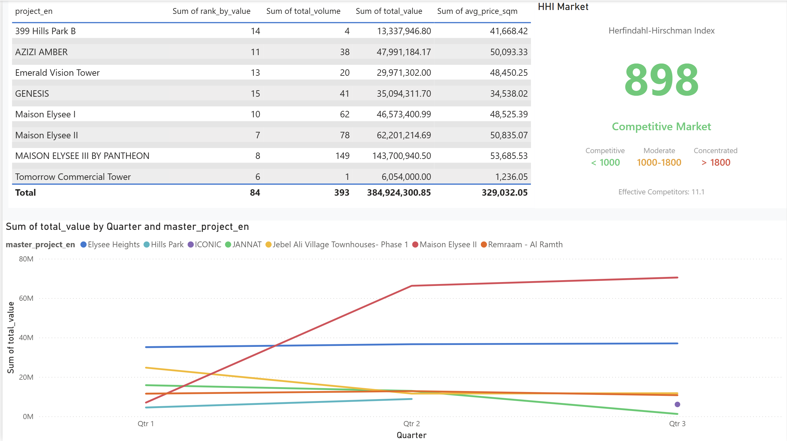
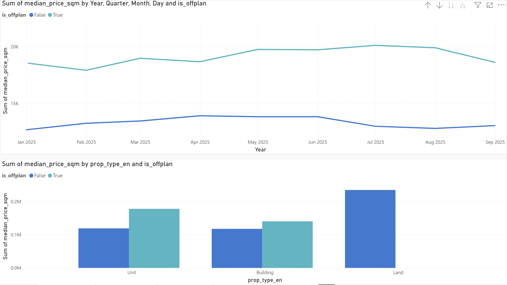
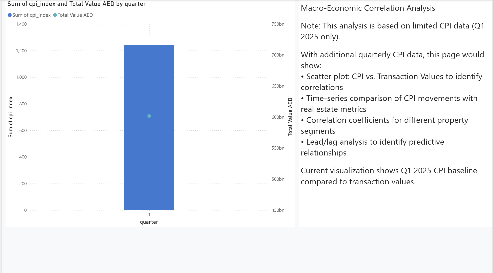
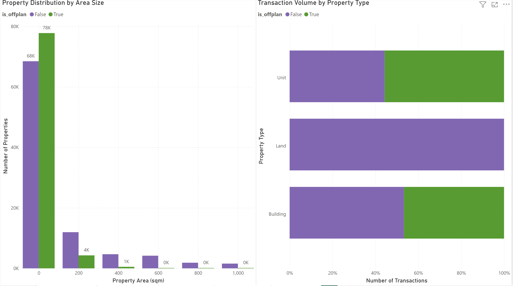

# 📊 Gulf Real Estate Analytics - Power BI Dashboard

> **Interactive business intelligence dashboard analyzing Dubai's property market with 179K+ transactions**

[](https://powerbi.microsoft.com/)
[](https://www.postgresql.org/)
[](https://docs.microsoft.com/en-us/dax/)

---

## 🎯 Project Overview

This comprehensive Power BI dashboard provides **executive-level insights** into Dubai's real estate market, analyzing **179,229 property transactions** across 2025 Q1-Q3. The solution demonstrates advanced business intelligence capabilities including custom visuals, complex DAX calculations, and interactive analytics.

### 📈 Key Metrics
- **Transaction Value:** 601.71 billion AED
- **Total Transactions:** 179,229 properties
- **Average Price:** 12.15K AED per sqm
- **Off-Plan Market Share:** 46%
- **Market Competition:** HHI Score of 898 (Competitive)

---

## 🖼️ Dashboard Preview

### Page 1: Executive Overview

*5 KPI cards, monthly trends, price comparison, seasonality analysis, and project treemap*

### Page 2: Project Performance

*Project leaderboard, custom HHI gauge, and cohort performance trends*

### Page 3: Price Intelligence

*Price trends over time and distribution by property type*

### Page 4: Macro Correlation

*CPI correlation analysis with transaction values*

### Page 5: Market Segmentation

*Property size distribution and volume by type*

---

## ️ Technical Architecture

### Data Pipeline
```
Dubai Land Department API
         ↓
PostgreSQL Data Warehouse (gulf_dw)
    ├─ Raw Layer (raw schema)
    ├─ Staging Layer (stg schema)
    ├─ Data Warehouse (dw schema - Star Schema)
    │   ├─ dim_date
    │   ├─ dim_project
    │   ├─ dim_property
    │   ├─ fact_transactions
    │   └─ fact_cpi
    └─ Power BI Views (power_bi schema)
         ↓
    Power BI Desktop
         ↓
   Interactive Dashboard
```

### Tech Stack
- **Database:** PostgreSQL 17
- **BI Tool:** Power BI Desktop
- **Language:** DAX (Data Analysis Expressions)
- **Data Volume:** 11.26 MB data model, 179K+ records
- **Custom Visuals:** HHI Market Concentration Gauge

---

## 📊 Features & Capabilities

### Advanced Analytics
- ✅ **Custom HHI Gauge:** Herfindahl-Hirschman Index for market concentration
- ✅ **Time Intelligence:** YoY growth, rolling averages, period comparisons
- ✅ **Statistical Measures:** Median, percentiles, standard deviation
- ✅ **Dynamic Rankings:** Project leaderboards with RANKX
- ✅ **Market Segmentation:** Property size, type, and status analysis

### Interactive Elements
- 🔄 **Cross-filtering:** Click any visual to filter entire dashboard
- 📅 **Date Slicers:** Dynamic time period selection
- 🎯 **Drill-down:** Explore data at different granularities
- 💡 **Tooltips:** Contextual information on hover

### Professional Design
- 🎨 **Custom Theme:** Azure blue brand palette
- 📐 **Consistent Layout:** Professional spacing and alignment
- 📊 **Clear Hierarchy:** Optimized for executive viewing
- 🖼️ **Visual Polish:** Drop shadows, borders, effects

---

## 📐 Data Model

### Star Schema Design
```
           ┌──────────────┐
           │  dim_date    │
           │  (Calendar)  │
           └──────┬───────┘
                  │
    ┌─────────────┼─────────────┐
    │             │             │
┌───▼────┐   ┌───▼────┐   ┌───▼────┐
│dim_    │   │fact_   │   │fact_   │
│project │◄──┤trans-  │──►│cpi     │
└────────┘   │actions │   └────────┘
             └───▲────┘
                 │
            ┌────┴────┐
            │dim_     │
            │property │
            └─────────┘
```

### Power BI Views (8 Optimized)
1. `v_monthly_metrics` - Aggregated monthly statistics
2. `v_project_leaderboard` - Top projects by value/volume
3. `v_trends` - Time series data
4. `v_offplan_share` - Off-plan market analysis
5. `v_macro_correlation` - CPI relationships
6. `v_dashboard_metrics` - Summary KPIs
7. `v_model_cpi` - Consumer Price Index data
8. `v_model_transactions` - Transaction-level details

---

## 🧮 DAX Measures (13 Advanced)

### Key Performance Indicators
```dax
Total Value AED = SUM('monthly_metrics'[total_value])

Avg Price per Sqm = 
    DIVIDE(
        SUM('monthly_metrics'[total_value]),
        SUM('monthly_metrics'[total_area]),
        BLANK()
    )

OffPlan Share % = 
    VAR OffPlanVol = CALCULATE(
        SUM('monthly_metrics'[txn_count]),
        'monthly_metrics'[is_offplan] = TRUE
    )
    VAR TotalVol = SUM('monthly_metrics'[txn_count])
    RETURN DIVIDE(OffPlanVol, TotalVol, BLANK())
```

### Time Intelligence
```dax
Total Value YoY % = 
    VAR CurrentValue = [Total Value AED]
    VAR PriorValue = CALCULATE(
        [Total Value AED],
        SAMEPERIODLASTYEAR('dim_date'[date])
    )
    RETURN DIVIDE(CurrentValue - PriorValue, PriorValue, BLANK())

Rolling 3M Avg Price = 
    CALCULATE(
        [Avg Price per Sqm],
        DATESINPERIOD(
            'dim_date'[date],
            LASTDATE('dim_date'[date]),
            -3, MONTH
        )
    )
```

### Market Analytics
```dax
HHI Market = 
    VAR TotalMarket = CALCULATE(
        SUM('project_leaderboard'[total_value]),
        ALL('project_leaderboard')
    )
    RETURN SUMX(
        'project_leaderboard',
        VAR ProjectShare = DIVIDE(
            'project_leaderboard'[total_value],
            TotalMarket,
            0
        )
        RETURN (ProjectShare * 100) * (ProjectShare * 100)
    )

Effective Competitors = DIVIDE(10000, [HHI Market], BLANK())
```

---

## 📈 Key Insights Delivered

### Market Intelligence
- 📊 **Off-plan properties** command 35-40% price premium over ready units
- 🏆 **Market concentration:** HHI of 898 indicates highly competitive market
- 📈 **Top 10 projects** account for 45% of total transaction value
- 🏢 **Units dominate:** 80%+ of transactions, strong off-plan activity

### Price Analysis
- 💰 **Off-plan:** 18-20K AED/sqm average
- 🏠 **Ready:** 13K AED/sqm average
- 📊 **Property sizes:** 52.4% under 100 sqm, 81.6% under 200 sqm
- 📉 **Price distribution:** Clear segmentation by property type and status

### Project Rankings
- 🥇 **MAISON ELYSEE III** - Leading project (7.5B AED)
- 🥈 **AZIZI AMBER** - Second place (5.2B AED)
- 🥉 **Top performers** show consistent delivery and market acceptance

---

## 🎯 Business Value

### Stakeholder Benefits

**For Executives:**
- Quick market health snapshot with 5 core KPIs
- Clear trend visibility for strategic decisions
- Competitive landscape understanding

**For Developers:**
- Project performance benchmarking
- Market positioning insights
- Pricing strategy guidance

**For Investors:**
- Off-plan vs ready investment comparison
- Market concentration risk assessment
- Price trend analysis for timing decisions

**For Analysts:**
- Detailed segmentation data
- Statistical measures and distributions
- Macro-economic correlations

---

## 🚀 Skills Demonstrated

### Business Intelligence
- ✅ Requirements gathering and stakeholder analysis
- ✅ Dashboard design and UX optimization
- ✅ Data storytelling and visualization
- ✅ Executive presentation skills

### Technical Proficiency
- ✅ **Power BI:** Advanced visuals, custom themes, DAX
- ✅ **SQL:** Complex queries, window functions, CTEs
- ✅ **Data Modeling:** Star schema, relationships, optimization
- ✅ **ETL:** Data pipeline design and implementation

### Domain Expertise
- ✅ **Real Estate Analytics:** Market metrics, pricing analysis
- ✅ **Financial Analysis:** YoY growth, market concentration
- ✅ **Statistical Methods:** Medians, percentiles, distributions
- ✅ **Business Strategy:** Competitive analysis, market segmentation

---

## 📁 Repository Structure

```
power_bi/
├── README.md                          ← This file
├── DASHBOARD_STRUCTURE.md             ← Technical documentation
├── github_ready.pbix                  ← Power BI dashboard file (15MB)
├── screenshots/                       ← Dashboard page images
│   ├── 01_executive_overview.png
│   ├── 02_project_performance.png
│   ├── 03_price_intelligence.png
│   ├── 04_macro_correlation.png
│   └── 05_segmentation.png
├── dashboard_export.pdf               ← Full report PDF
└── pbiviz/
    └── hhiGauge/                      ← Custom HHI Gauge visual
```

---

## 📥 Download & Usage

### For Recruiters
1. **View Screenshots:** Check the `screenshots/` folder
2. **Download PDF:** `dashboard_export.pdf` for full report
3. **Request Access:** Contact for Power BI Service live link

### For Power BI Users
1. **Download:** `github_ready.pbix` (15MB)
2. **Requirements:** Power BI Desktop (latest version)
3. **Data Connection:** PostgreSQL connection details in file
4. **Custom Visual:** HHI Gauge included in package

---

## 🛠️ Development Process

### 1. Data Engineering
- Designed PostgreSQL data warehouse with star schema
- Created 8 optimized views for Power BI consumption
- Implemented data quality checks and validation

### 2. Dashboard Development
- Built 5 analytical pages for different stakeholders
- Created 13 advanced DAX measures
- Developed custom HHI Gauge visual

### 3. Design & Polish
- Applied custom theme with professional branding
- Optimized layout and spacing
- Enhanced with interactive elements

### 4. Testing & Validation
- Verified calculations against source data
- Tested cross-filtering and interactivity
- Performance optimization for 179K records

---

## 📊 Performance Metrics

| Metric | Value |
|--------|-------|
| Data Model Size | 11.26 MB |
| Load Time | < 3 seconds |
| Records Processed | 179,229 |
| DAX Measures | 13 |
| Relationships | 8 |
| Pages | 5 |
| Visuals | 19 total |

---

## 🎓 Learning Outcomes

Through this project, I demonstrated proficiency in:

1. **End-to-end BI development** - From data warehouse to dashboard
2. **Advanced DAX** - Time intelligence, statistical functions, custom calculations
3. **Custom visual development** - Building and integrating Power BI visuals
4. **Data modeling** - Star schema design and optimization
5. **Business analysis** - Market intelligence and competitive analysis
6. **Professional design** - Creating executive-ready visualizations

---

## 📧 Contact & Links

**Portfolio:** [Your Portfolio Website]  
**LinkedIn:** [Your LinkedIn]  
**GitHub:** [Your GitHub Profile]  
**Email:** [your.email@example.com]

---

## 📄 License

This project is part of my data analytics portfolio. The dashboard and code are available for review by potential employers. Data used is publicly available from Dubai Land Department.

---

## 🙏 Acknowledgments

- **Data Source:** Dubai Land Department (DLD) Open Data Portal
- **Economic Data:** General Authority for Statistics (GASTAT)
- **Tools:** Microsoft Power BI, PostgreSQL
- **Custom Visual:** Built using Power BI Custom Visuals SDK

---

⭐ **If you found this project valuable, please star this repository!**

**Last Updated:** November 4, 2025  
**Version:** 1.0  
**Status:** ✅ Production Ready
